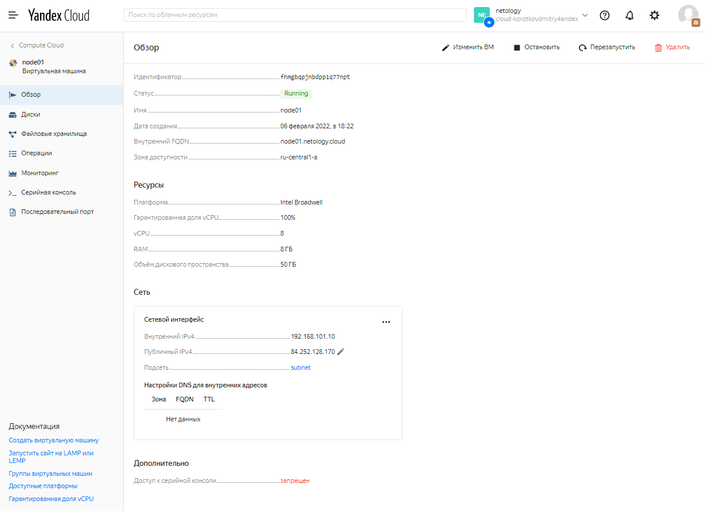

# Домашнее задание к занятию "5.4. Оркестрация группой Docker контейнеров на примере Docker Compose"
## Задача 1

Создать собственный образ операционной системы с помощью Packer.

- Скриншот страницы, как на слайде из презентации (слайд 37).

  

## Задача 2

Создать вашу первую виртуальную машину в Яндекс.Облаке.

- Скриншот страницы свойств созданной ВМ

  

## Задача 3

Создать ваш первый готовый к боевой эксплуатации компонент мониторинга, состоящий из стека микросервисов.

- Скриншот работающего веб-интерфейса Grafana с текущими метриками

  
  

