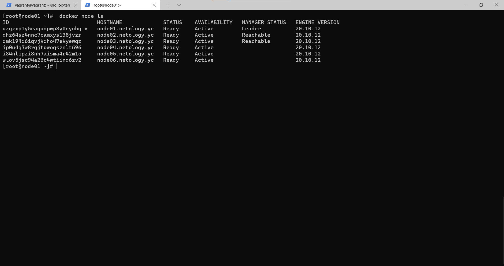
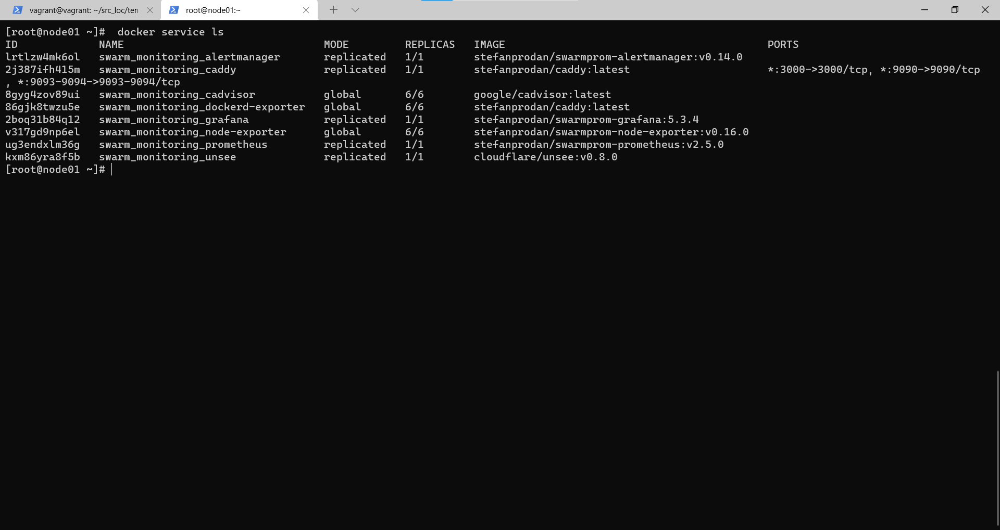

# Домашнее задание к занятию "5.5. Оркестрация кластером Docker контейнеров на примере Docker Swarm"

## Задача 1

Дайте письменые ответы на следующие вопросы:

- В чём отличие режимов работы сервисов в Docker Swarm кластере: replication и global?

replication - для службы указывается количество идентичных задач, которые планируется запустить. Например, служба с тремя репликами, каждая из которых обслуживает один и тот же контент.

global — это служба, которая запускает одну задачу на каждом узле. Количество заданий не задается. При добавлении node в swarm, оркестратор создает задачу, а планировщик назначает задачу новому node. Например, агенты мониторинга, антивирусные сканеры, т.е. контейнеры, которые необходимо запускать на каждом node.

- Какой алгоритм выбора лидера используется в Docker Swarm кластере?

Алгоритм Raft (визуализация).

- Что такое Overlay Network?

Это распределенная сеть между несколькими узлами демона Docker. Эта сеть перекрывает сети хоста, позволяя контейнерам, безопасно обмениваться данными при включенном шифровании.
При инициализации Docker создает две новые:
Overlay Network для трафика управления и данных;
Сеть-мост docker_gwbridge, которая соединяет отдельный демон Docker с другими демонами, участвующими в архитектуре.

## Задача 2

Создать ваш первый Docker Swarm кластер в Яндекс.Облаке

```
vagrant@vagrant:~$ ssh centos@84.201.128.25
[centos@node01 ~]$ sudo -i
[root@node01 ~]#  docker node ls
ID                            HOSTNAME             STATUS    AVAILABILITY   MANAGER STATUS   ENGINE VERSION
uzgzxp1y5caqudpwp8y0nyubq *   node01.netology.yc   Ready     Active         Leader           20.10.12
qhz64sz4nnc7camxys138jvzr     node02.netology.yc   Ready     Active         Reachable        20.10.12
qmk194d6iqvjkqho47ekyewqz     node03.netology.yc   Ready     Active         Reachable        20.10.12
ip0u4q7w8rgjtowoqsznlt696     node04.netology.yc   Ready     Active                          20.10.12
i84nlipzi8nh7aisma4r42m1o     node05.netology.yc   Ready     Active                          20.10.12
wlov5jsc94a26c4wtiinq6zv2     node06.netology.yc   Ready     Active                          20.10.12
[root@node01 ~]#
```
<p align="center">
  
</p>
## Задача 3

Создать ваш первый, готовый к боевой эксплуатации кластер мониторинга, состоящий из стека микросервисов.

```
[root@node01 ~]#  docker service ls
ID             NAME                                MODE         REPLICAS   IMAGE                                          PORTS
lrtlzw4mk6ol   swarm_monitoring_alertmanager       replicated   1/1        stefanprodan/swarmprom-alertmanager:v0.14.0
2j387ifh415m   swarm_monitoring_caddy              replicated   1/1        stefanprodan/caddy:latest                      *:3000->3000/tcp, *:9090->9090/tcp, *:9093-9094->9093-9094/tcp
8gyg4zov89ui   swarm_monitoring_cadvisor           global       6/6        google/cadvisor:latest
86gjk8twzu5e   swarm_monitoring_dockerd-exporter   global       6/6        stefanprodan/caddy:latest
2boq31b84q12   swarm_monitoring_grafana            replicated   1/1        stefanprodan/swarmprom-grafana:5.3.4
v317gd9np6el   swarm_monitoring_node-exporter      global       6/6        stefanprodan/swarmprom-node-exporter:v0.16.0
ug3endxlm36g   swarm_monitoring_prometheus         replicated   1/1        stefanprodan/swarmprom-prometheus:v2.5.0
kxm86yra8f5b   swarm_monitoring_unsee              replicated   1/1        cloudflare/unsee:v0.8.0
[root@node01 ~]#
```
<p align="center">
  
</p>
