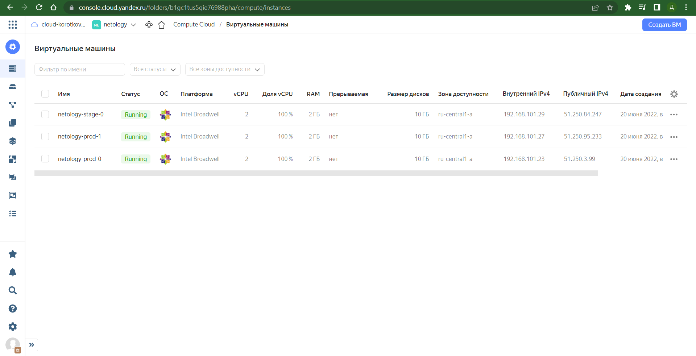
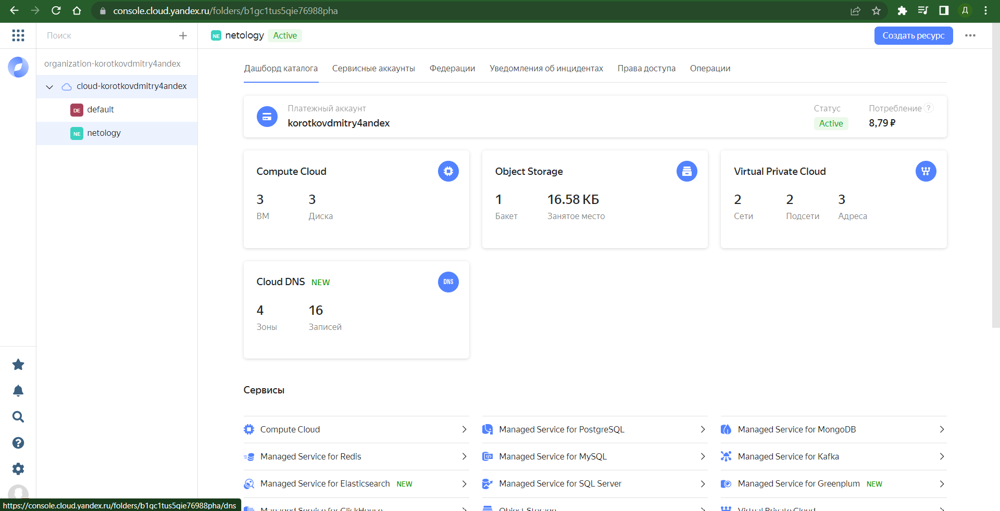
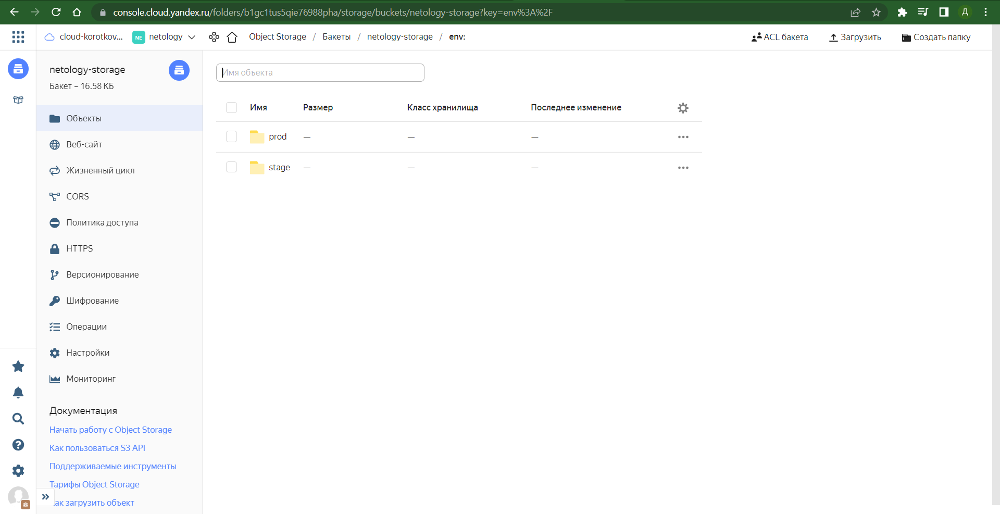

# Домашнее задание к занятию "7.3. Основы и принцип работы Терраформ"

## Задача 1. Создадим бэкэнд в S3 (необязательно, но крайне желательно).

Если в рамках предыдущего задания у вас уже есть аккаунт AWS, то давайте продолжим знакомство со взаимодействием
терраформа и aws. 

1. Создайте s3 бакет, iam роль и пользователя от которого будет работать терраформ. Можно создать отдельного пользователя,
а можно использовать созданного в рамках предыдущего задания, просто добавьте ему необходимы права, как описано 
[здесь](https://www.terraform.io/docs/backends/types/s3.html).
1. Зарегистрируйте бэкэнд в терраформ проекте как описано по ссылке выше. 


## Задача 2. Инициализируем проект и создаем воркспейсы. 

1. Выполните `terraform init`:
    * если был создан бэкэнд в S3, то терраформ создат файл стейтов в S3 и запись в таблице 
dynamodb.
    * иначе будет создан локальный файл со стейтами.  
1. Создайте два воркспейса `stage` и `prod`.
1. В уже созданный `aws_instance` добавьте зависимость типа инстанса от вокспейса, что бы в разных ворскспейсах 
использовались разные `instance_type`.
1. Добавим `count`. Для `stage` должен создаться один экземпляр `ec2`, а для `prod` два. 
1. Создайте рядом еще один `aws_instance`, но теперь определите их количество при помощи `for_each`, а не `count`.
1. Что бы при изменении типа инстанса не возникло ситуации, когда не будет ни одного инстанса добавьте параметр
жизненного цикла `create_before_destroy = true` в один из рессурсов `aws_instance`.
1. При желании поэкспериментируйте с другими параметрами и рессурсами.

В виде результата работы пришлите:
* Вывод команды `terraform workspace list`.
* Вывод команды `terraform plan` для воркспейса `prod`.  

## Решение

[main.tf](./src/main.tf)

[instance.tf](./src/instance/instance.tf)

```
vagrant@vagrant:/vagrant/terraform$ terraform workspace list
  default
* prod
  stage
vagrant@vagrant:/vagrant/terraform$ terraform plan

Terraform used the selected providers to generate the following execution plan. Resource actions are indicated with the following symbols:
  + create

Terraform will perform the following actions:

  # yandex_vpc_network.default will be created
  + resource "yandex_vpc_network" "default" {
      + created_at                = (known after apply)
      + default_security_group_id = (known after apply)
      + folder_id                 = (known after apply)
      + id                        = (known after apply)
      + name                      = "net-prod"
      + subnet_ids                = (known after apply)
    }

  # yandex_vpc_subnet.default will be created
  + resource "yandex_vpc_subnet" "default" {
      + created_at     = (known after apply)
      + folder_id      = (known after apply)
      + id             = (known after apply)
      + name           = "subnet-prod"
      + network_id     = (known after apply)
      + v4_cidr_blocks = [
          + "192.168.101.0/24",
        ]
      + v6_cidr_blocks = (known after apply)
      + zone           = "ru-central1-a"
    }

  # module.news.yandex_compute_instance.instance[0] will be created
  + resource "yandex_compute_instance" "instance" {
      + created_at                = (known after apply)
      + description               = "instance from terraform"
      + folder_id                 = "b1gc1tus5qie76988pha"
      + fqdn                      = (known after apply)
      + hostname                  = (known after apply)
      + id                        = (known after apply)
      + metadata                  = {
          + "ssh-keys" = <<-EOT
                centos:ssh-rsa AAAAB3NzaC1yc2EAAAADAQABAAABgQDrmZp00dmHnzFl6FENgioa0PnElNgx6nfRBNg1tE5Poduup/lJQHsxHyCM8X5H0VM3YQ9PCBK0YtA21NtQxUw8WTYrb5byPyqKVKqpu3AaiHf2QlRIcWw3We0tXImr
IwBFQrw3GwYL3Rdd/w7advHFap+Nqt9yPNFfFrEnpLtK/DvflnSU3if4rwtldhae67a1wwwGtr4Mi0ZdDxtsINsXo0v/9Quh2ZZIet195LOXEsbu/+8H0DeEFQq7QAWDg0DfDA69YoRsJAmsVgystaTkaGUXCxS9M0aiRZAj6t+yDTRXsVV65aA6x8x
3lW8J8vNQPCOrAdIRTYUPBmSC7O94T+cUjbM+0wigncW8OW24B4guSSX087ksj9VwOTMDW5Bcp6MDfZ0Py/ftWORUxmdcOWYPpBzh2tNE7s3hggHZoHhfvWtb9gX7gJY2UcNS+CTFfMEnr8MmnToyGuYDHFCEV7cez6RF5jNEC8SI6U+0a8pGo9ElhX
U5EGJ7NlDGbjE= vagrant@vagrant
            EOT
        }
      + name                      = "netology-prod-0"
      + network_acceleration_type = "standard"
      + platform_id               = "standard-v1"
      + service_account_id        = (known after apply)
      + status                    = (known after apply)
      + zone                      = (known after apply)

      + boot_disk {
          + auto_delete = true
          + device_name = (known after apply)
          + disk_id     = (known after apply)
          + mode        = (known after apply)

          + initialize_params {
              + description = (known after apply)
              + image_id    = "fd80rnhvc47031anomed"
              + name        = (known after apply)
              + size        = (known after apply)
              + snapshot_id = (known after apply)
              + type        = "network-hdd"
            }
        }

      + network_interface {
          + index              = (known after apply)
          + ip_address         = (known after apply)
          + ipv4               = true
          + ipv6               = (known after apply)
          + ipv6_address       = (known after apply)
          + mac_address        = (known after apply)
          + nat                = true
          + nat_ip_address     = (known after apply)
          + nat_ip_version     = (known after apply)
          + security_group_ids = (known after apply)
          + subnet_id          = (known after apply)
        }

      + placement_policy {
          + placement_group_id = (known after apply)
        }

      + resources {
          + core_fraction = 100
          + cores         = 2
          + memory        = 2
        }

      + scheduling_policy {
          + preemptible = (known after apply)
        }
    }

  # module.news.yandex_compute_instance.instance[1] will be created
  + resource "yandex_compute_instance" "instance" {
      + created_at                = (known after apply)
      + description               = "instance from terraform"
      + folder_id                 = "b1gc1tus5qie76988pha"
      + fqdn                      = (known after apply)
      + hostname                  = (known after apply)
      + id                        = (known after apply)
      + metadata                  = {
          + "ssh-keys" = <<-EOT
                centos:ssh-rsa AAAAB3NzaC1yc2EAAAADAQABAAABgQDrmZp00dmHnzFl6FENgioa0PnElNgx6nfRBNg1tE5Poduup/lJQHsxHyCM8X5H0VM3YQ9PCBK0YtA21NtQxUw8WTYrb5byPyqKVKqpu3AaiHf2QlRIcWw3We0tXImr
IwBFQrw3GwYL3Rdd/w7advHFap+Nqt9yPNFfFrEnpLtK/DvflnSU3if4rwtldhae67a1wwwGtr4Mi0ZdDxtsINsXo0v/9Quh2ZZIet195LOXEsbu/+8H0DeEFQq7QAWDg0DfDA69YoRsJAmsVgystaTkaGUXCxS9M0aiRZAj6t+yDTRXsVV65aA6x8x
3lW8J8vNQPCOrAdIRTYUPBmSC7O94T+cUjbM+0wigncW8OW24B4guSSX087ksj9VwOTMDW5Bcp6MDfZ0Py/ftWORUxmdcOWYPpBzh2tNE7s3hggHZoHhfvWtb9gX7gJY2UcNS+CTFfMEnr8MmnToyGuYDHFCEV7cez6RF5jNEC8SI6U+0a8pGo9ElhX
U5EGJ7NlDGbjE= vagrant@vagrant
            EOT
        }
      + name                      = "netology-prod-1"
      + network_acceleration_type = "standard"
      + platform_id               = "standard-v1"
      + service_account_id        = (known after apply)
      + status                    = (known after apply)
      + zone                      = (known after apply)

      + boot_disk {
          + auto_delete = true
          + device_name = (known after apply)
          + disk_id     = (known after apply)
          + mode        = (known after apply)

          + initialize_params {
              + description = (known after apply)
              + image_id    = "fd80rnhvc47031anomed"
              + name        = (known after apply)
              + size        = (known after apply)
              + snapshot_id = (known after apply)
              + type        = "network-hdd"
            }
        }

      + network_interface {
          + index              = (known after apply)
          + ip_address         = (known after apply)
          + ipv4               = true
          + ipv6               = (known after apply)
          + ipv6_address       = (known after apply)
          + mac_address        = (known after apply)
          + nat                = true
          + nat_ip_address     = (known after apply)
          + nat_ip_version     = (known after apply)
          + security_group_ids = (known after apply)
          + subnet_id          = (known after apply)
        }

      + placement_policy {
          + placement_group_id = (known after apply)
        }

      + resources {
          + core_fraction = 100
          + cores         = 2
          + memory        = 2
        }

      + scheduling_policy {
          + preemptible = (known after apply)
        }
    }

Plan: 4 to add, 0 to change, 0 to destroy.

──────────────────────────────────────────────────────────────────────────────────────────────────────────────────────────────────────────────────────────────────────────────────────────

Note: You didn't use the -out option to save this plan, so Terraform can't guarantee to take exactly these actions if you run "terraform apply" now.  
```

<p align="center">
  
</p>

<p align="center">
  
</p>

<p align="center">
  
</p>
