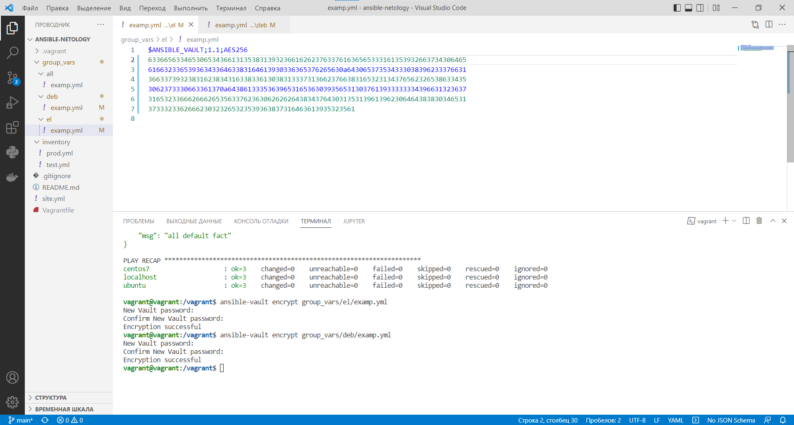
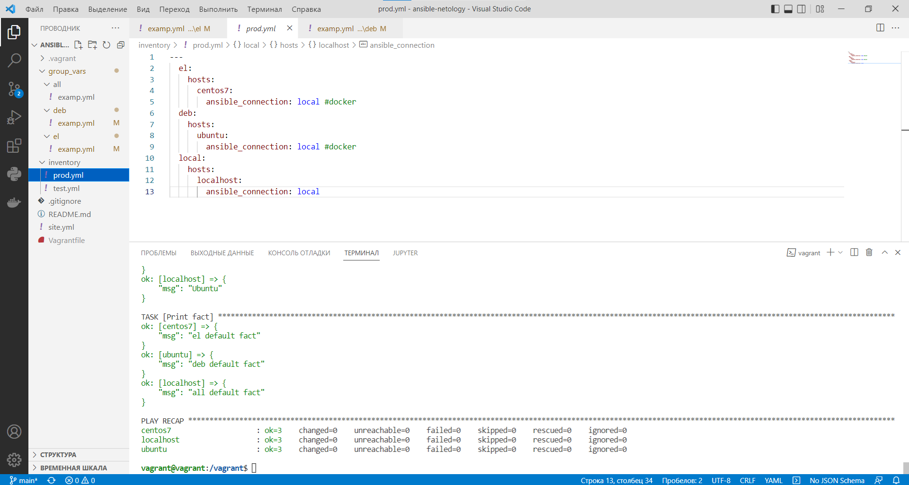

# Домашнее задание к занятию "08.01 Введение в Ansible"

## Подготовка к выполнению
1. Установите ansible версии 2.10 или выше.
2. Создайте свой собственный публичный репозиторий на github с произвольным именем.
3. Скачайте [playbook](https://github.com/netology-code/mnt-homeworks/tree/MNT-7/08-ansible-01-base/playbook/) из репозитория с домашним заданием и перенесите его в свой репозиторий.

## Основная часть
1. Попробуйте запустить playbook на окружении из `test.yml`, зафиксируйте какое значение имеет факт `some_fact` для указанного хоста при выполнении playbook'a.
2. Найдите файл с переменными (group_vars) в котором задаётся найденное в первом пункте значение и поменяйте его на 'all default fact'.
3. Воспользуйтесь подготовленным (используется `docker`) или создайте собственное окружение для проведения дальнейших испытаний.
4. Проведите запуск playbook на окружении из `prod.yml`. Зафиксируйте полученные значения `some_fact` для каждого из `managed host`.
5. Добавьте факты в `group_vars` каждой из групп хостов так, чтобы для `some_fact` получились следующие значения: для `deb` - 'deb default fact', для `el` - 'el default fact'.
6.  Повторите запуск playbook на окружении `prod.yml`. Убедитесь, что выдаются корректные значения для всех хостов.
7. При помощи `ansible-vault` зашифруйте факты в `group_vars/deb` и `group_vars/el` с паролем `netology`.
8. Запустите playbook на окружении `prod.yml`. При запуске `ansible` должен запросить у вас пароль. Убедитесь в работоспособности.
9. Посмотрите при помощи `ansible-doc` список плагинов для подключения. Выберите подходящий для работы на `control node`.
10. В `prod.yml` добавьте новую группу хостов с именем  `local`, в ней разместите localhost с необходимым типом подключения.
11. Запустите playbook на окружении `prod.yml`. При запуске `ansible` должен запросить у вас пароль. Убедитесь что факты `some_fact` для каждого из хостов определены из верных `group_vars`.
12. Заполните `README.md` ответами на вопросы. Сделайте `git push` в ветку `master`. В ответе отправьте ссылку на ваш открытый репозиторий с изменённым `playbook` и заполненным `README.md`.

## Решение

[playbook](https://github.com/korotkov-dmitry/ansible-netology)

```
vagrant@vagrant:/vagrant$ ansible-playbook -i inventory/test.yml site.yml

PLAY [Print os facts] **********************************************************

TASK [Gathering Facts] *********************************************************
ok: [localhost]

TASK [Print OS] ****************************************************************
ok: [localhost] => {
    "msg": "Ubuntu"
}

TASK [Print fact] **************************************************************
ok: [localhost] => {
    "msg": "all default fact"
}

PLAY RECAP *********************************************************************
localhost                  : ok=3    changed=0    unreachable=0    failed=0    skipped=0    rescued=0    ignored=0

vagrant@vagrant:/vagrant$ ansible-playbook -i inventory/prod.yml site.yml

PLAY [Print os facts] **********************************************************

TASK [Gathering Facts] *********************************************************
ok: [centos7]
ok: [localhost]
ok: [ubuntu]

TASK [Print OS] ****************************************************************
ok: [centos7] => {
    "msg": "Ubuntu"
}
ok: [ubuntu] => {
    "msg": "Ubuntu"
}
ok: [localhost] => {
    "msg": "Ubuntu"
}

TASK [Print fact] **************************************************************
ok: [centos7] => {
    "msg": "el default fact"
}
ok: [ubuntu] => {
    "msg": "deb default fact"
}
ok: [localhost] => {
    "msg": "all default fact"
}

PLAY RECAP *********************************************************************
centos7                    : ok=3    changed=0    unreachable=0    failed=0    skipped=0    rescued=0    ignored=0
localhost                  : ok=3    changed=0    unreachable=0    failed=0    skipped=0    rescued=0    ignored=0
ubuntu                     : ok=3    changed=0    unreachable=0    failed=0    skipped=0    rescued=0    ignored=0
```

<p align="center">
  
</p>

```
vagrant@vagrant:/vagrant$ ansible-playbook -i inventory/prod.yml site.yml --ask-vault-pass
Vault password: 

PLAY [Print os facts] ***********************************************************************************************************************************************************
TASK [Gathering Facts] **********************************************************************************************************************************************************ok: [centos7]
ok: [ubuntu]
ok: [localhost]

TASK [Print OS] *****************************************************************************************************************************************************************ok: [centos7] => { 
    "msg": "Ubuntu"
}
ok: [ubuntu] => {  
    "msg": "Ubuntu"
}
ok: [localhost] => {
    "msg": "Ubuntu" 
}

TASK [Print fact] ***************************************************************************************************************************************************************ok: [centos7] => {
    "msg": "el default fact"
}
ok: [ubuntu] => {
    "msg": "deb default fact"
}
ok: [localhost] => {
    "msg": "all default fact"
}

PLAY RECAP **********************************************************************************************************************************************************************centos7                    : ok=3    changed=0    unreachable=0    failed=0    skipped=0    rescued=0    ignored=0
localhost                  : ok=3    changed=0    unreachable=0    failed=0    skipped=0    rescued=0    ignored=0
ubuntu                     : ok=3    changed=0    unreachable=0    failed=0    skipped=0    rescued=0    ignored=0
```

<p align="center">
  
</p>
