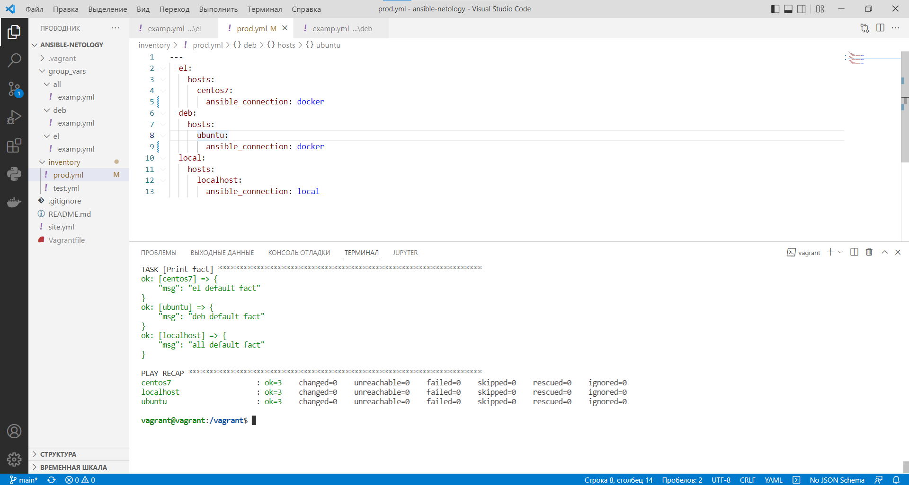

# Домашнее задание к занятию "08.01 Введение в Ansible"

## Подготовка к выполнению
1. Установите ansible версии 2.10 или выше.
2. Создайте свой собственный публичный репозиторий на github с произвольным именем.
3. Скачайте [playbook](https://github.com/netology-code/mnt-homeworks/tree/MNT-7/08-ansible-01-base/playbook/) из репозитория с домашним заданием и перенесите его в свой репозиторий.

## Основная часть
1. Попробуйте запустить playbook на окружении из `test.yml`, зафиксируйте какое значение имеет факт `some_fact` для указанного хоста при выполнении playbook'a.
2. Найдите файл с переменными (group_vars) в котором задаётся найденное в первом пункте значение и поменяйте его на 'all default fact'.
3. Воспользуйтесь подготовленным (используется `docker`) или создайте собственное окружение для проведения дальнейших испытаний.
4. Проведите запуск playbook на окружении из `prod.yml`. Зафиксируйте полученные значения `some_fact` для каждого из `managed host`.
5. Добавьте факты в `group_vars` каждой из групп хостов так, чтобы для `some_fact` получились следующие значения: для `deb` - 'deb default fact', для `el` - 'el default fact'.
6.  Повторите запуск playbook на окружении `prod.yml`. Убедитесь, что выдаются корректные значения для всех хостов.
7. При помощи `ansible-vault` зашифруйте факты в `group_vars/deb` и `group_vars/el` с паролем `netology`.
8. Запустите playbook на окружении `prod.yml`. При запуске `ansible` должен запросить у вас пароль. Убедитесь в работоспособности.
9. Посмотрите при помощи `ansible-doc` список плагинов для подключения. Выберите подходящий для работы на `control node`.
10. В `prod.yml` добавьте новую группу хостов с именем  `local`, в ней разместите localhost с необходимым типом подключения.
11. Запустите playbook на окружении `prod.yml`. При запуске `ansible` должен запросить у вас пароль. Убедитесь что факты `some_fact` для каждого из хостов определены из верных `group_vars`.
12. Заполните `README.md` ответами на вопросы. Сделайте `git push` в ветку `master`. В ответе отправьте ссылку на ваш открытый репозиторий с изменённым `playbook` и заполненным `README.md`.

## Решение
### Запуск локально
[playbook](https://github.com/korotkov-dmitry/ansible-netology)

```
vagrant@vagrant:/vagrant$ ansible-playbook -i inventory/test.yml site.yml

PLAY [Print os facts] **********************************************************

TASK [Gathering Facts] *********************************************************
ok: [localhost]

TASK [Print OS] ****************************************************************
ok: [localhost] => {
    "msg": "Ubuntu"
}

TASK [Print fact] **************************************************************
ok: [localhost] => {
    "msg": "all default fact"
}

PLAY RECAP *********************************************************************
localhost                  : ok=3    changed=0    unreachable=0    failed=0    skipped=0    rescued=0    ignored=0

vagrant@vagrant:/vagrant$ ansible-playbook -i inventory/prod.yml site.yml

PLAY [Print os facts] **********************************************************

TASK [Gathering Facts] *********************************************************
ok: [centos7]
ok: [localhost]
ok: [ubuntu]

TASK [Print OS] ****************************************************************
ok: [centos7] => {
    "msg": "Ubuntu"
}
ok: [ubuntu] => {
    "msg": "Ubuntu"
}
ok: [localhost] => {
    "msg": "Ubuntu"
}

TASK [Print fact] **************************************************************
ok: [centos7] => {
    "msg": "el default fact"
}
ok: [ubuntu] => {
    "msg": "deb default fact"
}
ok: [localhost] => {
    "msg": "all default fact"
}

PLAY RECAP *********************************************************************
centos7                    : ok=3    changed=0    unreachable=0    failed=0    skipped=0    rescued=0    ignored=0
localhost                  : ok=3    changed=0    unreachable=0    failed=0    skipped=0    rescued=0    ignored=0
ubuntu                     : ok=3    changed=0    unreachable=0    failed=0    skipped=0    rescued=0    ignored=0
```

<p align="center">
  
</p>

```
vagrant@vagrant:/vagrant$ ansible-playbook -i inventory/prod.yml site.yml --ask-vault-pass
Vault password: 

PLAY [Print os facts] ***********************************************************************************************************************************************************
TASK [Gathering Facts] **********************************************************************************************************************************************************ok: [centos7]
ok: [ubuntu]
ok: [localhost]

TASK [Print OS] *****************************************************************************************************************************************************************ok: [centos7] => { 
    "msg": "Ubuntu"
}
ok: [ubuntu] => {  
    "msg": "Ubuntu"
}
ok: [localhost] => {
    "msg": "Ubuntu" 
}

TASK [Print fact] ***************************************************************************************************************************************************************ok: [centos7] => {
    "msg": "el default fact"
}
ok: [ubuntu] => {
    "msg": "deb default fact"
}
ok: [localhost] => {
    "msg": "all default fact"
}

PLAY RECAP **********************************************************************************************************************************************************************centos7                    : ok=3    changed=0    unreachable=0    failed=0    skipped=0    rescued=0    ignored=0
localhost                  : ok=3    changed=0    unreachable=0    failed=0    skipped=0    rescued=0    ignored=0
ubuntu                     : ok=3    changed=0    unreachable=0    failed=0    skipped=0    rescued=0    ignored=0
```

<p align="center">
  
</p>
### Запуск через Docker
```
vagrant@vagrant:~$ docker pull pycontribs/ubuntu
Using default tag: latest                                               und: manifest unknown: manifest unknown
latest: Pulling from pycontribs/ubuntu
423ae2b273f4: Pull complete
de83a2304fa1: Pull complete
f9a83bce3af0: Pull complete
b6b53be908de: Pull complete
7378af08dad3: Pull complete
Digest: sha256:dcb590e80d10d1b55bd3d00aadf32de8c413531d5cc4d72d0849d43f45cb7ec4
Status: Downloaded newer image for pycontribs/ubuntu:latest             5cb7ec4
docker.io/pycontribs/ubuntu:latest
vagrant@vagrant:~$ docker pull pycontribs/centos:7
7: Pulling from pycontribs/centos
2d473b07cdd5: Pull complete
43e1b1841fcc: Pull complete
85bf99ab446d: Pull complete
Digest: sha256:b3ce994016fd728998f8ebca21eb89bf4e88dbc01ec2603c04cc9c56ca964c69                                                                 a964c69
Status: Downloaded newer image for pycontribs/centos:7
docker.io/pycontribs/centos:7
vagrant@vagrant:~$ docker run --name centos7 -d pycontribs/centos:7 sleep 600000000
9a26652e2e6acc18c3c335c6978ef7b75be89a142108f011245698bdb1be7bd7
vagrant@vagrant:~$ docker run --name ubuntu -d pycontribs/ubuntu sleep 600000000
7f66b50e1d7f5ce986484a58614782892c36b37282b2230e37fdb50406db61f9
vagrant@vagrant:~$ cd ..//..//../vagrant
vagrant@vagrant:/vagrant$ ansible-playbook -i inventory/prod.yml site.yml --ask-vault-pass
Vault password: 

PLAY [Print os facts] **********************************************************

TASK [Gathering Facts] *********************************************************
ok: [localhost]
ok: [ubuntu]
ok: [centos7]

TASK [Print OS] ****************************************************************
ok: [centos7] => {
    "msg": "CentOS"
}
ok: [ubuntu] => {
    "msg": "Ubuntu"
}
ok: [localhost] => {
    "msg": "Ubuntu"
}

TASK [Print fact] **************************************************************
ok: [centos7] => {
    "msg": "el default fact"
}
ok: [ubuntu] => {
    "msg": "deb default fact"
}
ok: [localhost] => {
    "msg": "all default fact"
}

PLAY RECAP *********************************************************************
centos7                    : ok=3    changed=0    unreachable=0    failed=0    skipped=0    rescued=0    ignored=0
localhost                  : ok=3    changed=0    unreachable=0    failed=0    skipped=0    rescued=0    ignored=0
ubuntu                     : ok=3    changed=0    unreachable=0    failed=0    skipped=0    rescued=0    ignored=0
```

<p align="center">
  
</p>
### Документация
```
vagrant@vagrant:/vagrant$ ansible-doc -t connection ssh
> ANSIBLE.BUILTIN.SSH    (/home/vagrant/.local/lib/python3.8/site-packages/ansible/plugins/connection/ssh.py)

        This connection plugin allows Ansible to communicate to the target machines through normal SSH command line. Ansible does not expose
        a channel to allow communication between the user and the SSH process to accept a password manually to decrypt an SSH key when using
        this connection plugin (which is the default). The use of `ssh-agent' is highly recommended.

ADDED IN: historical

OPTIONS (= is mandatory):

- control_path
        This is the location to save SSH's ControlPath sockets, it uses SSH's variable substitution.
        Since 2.3, if null (default), ansible will generate a unique hash. Use ``%(directory)s`` to indicate where to use the control dir
        path setting.
        Before 2.3 it defaulted to ``control_path=%(directory)s/ansible-ssh-%%h-%%p-%%r``.
        Be aware that this setting is ignored if `-o ControlPath' is set in ssh args.
        [Default: (null)]
        set_via:
          env:
          - name: ANSIBLE_SSH_CONTROL_PATH
          ini:
:
```
